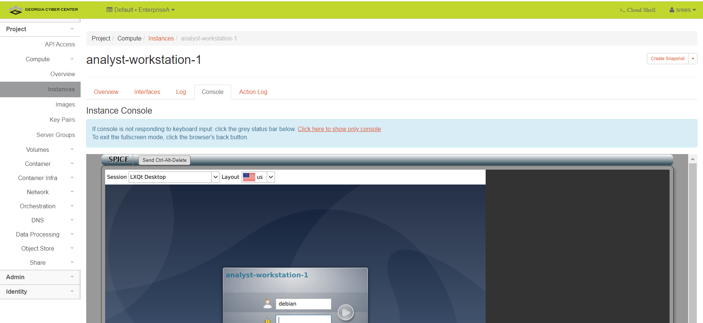

Getting Started (with Horizon)
==============================

- To interact with virtual machines (VMs) hosted on the Georgia Cyber Center through a web browser from anywhere with sufficient internet access. We reccommend at least 20Mbps download speeds for the best experience. You can access dashboard of your account through “Horizon”. 

- To reach the dashboard for the Georgia Cyber Range, visit:
(https://dashboard.gacyberrange.org)

- Your username and a default password are available to you after you complete the Quick Start training. You will be required to read and complete the attestation of the end-user license agreement (EULA) before you before you recieve your log in information. Ensure that you fill in the "domain" section at the login page with "default".  See the image below of the login window.

Once you've logged in
======================

*Change your password*

- You will need to change your password within 48hrs of account creation to ensure your account is not disabled.  To do this, locate the dropdown at the right top of the screen.  The dropdown menu should include a "settings" option.  Navitgate to "settings.

- Within the settings page, you will see on the left, horizonal menu bar, the "change password" option where you can set a new, password for your account. See the image below.

*Accessing your Environement* 

- To create or interact with VM's in your cloud environment will will access the “project” dropdown menu on the far left of the screen.  Once you extend the menu, you will select the "compute" option.  click to open the sub-pages and locate "instance". Click on "instance" to open this page, where the details and console access to your VM's exists. See the image below.

- In the image above, there are no VM's deployed. You may have VM's in this area already if your Range access is a part of a training module. If you are using the range without an associated training module, you can create VM's here within the limited of your allocated resources. 

*Using a VM in your Environment* 
 
- Select a VM (instance) to access and click on the instance name; this opens a new view on the page. at the top of this view, select and click on the "console" tab. This is where you can access the GUI/CLI of the instance OS. See the image below.

    
Need Help?
==============================
Contact helpdesk support at 706-721-4000. Let the helpdesk technican know that you need to submit a ticket for the Georgia Cyber Range. You will be contacted as soon as a cyber range support technician is available. Please ensure you leave good contact information so they may reach you about your issues.

