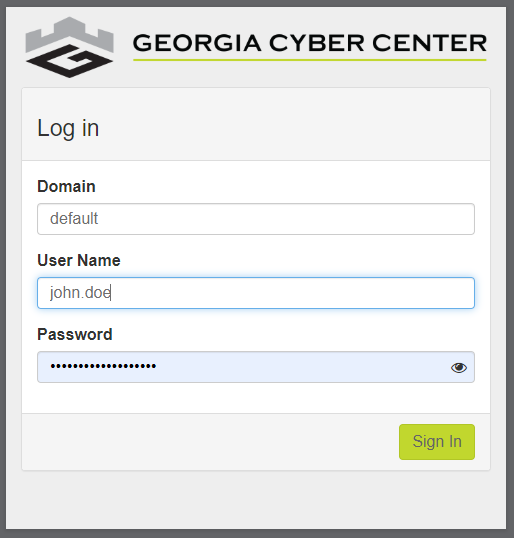
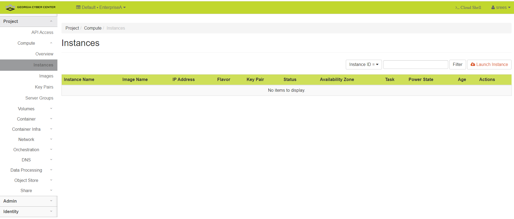

Getting Started (with Horizon)
==============================

- To interact with virtual machines (VMs) hosted on the Georgia Cyber Center through a web browser from anywhere with sufficient internet access. We reccommend at least 20Mbps download speeds for the best experience. You can access dashboard of your account through “Horizon”. 

- To reach the dashboard for the Georgia Cyber Range, visit:
(https://dashboard.gacyberrange.org)

- Your username and a default password are available to you after you complete the Quick Start training. You will be required to read and complete the attestation of the end-user license agreement (EULA) before you before you recieve your log in information. Ensure that you fill in the "domain" section at the login page with "default".  See the image below of the login window.

Once you've logged in
======================

*Change your password*

- You will need to change your password within 48hrs of account creation to ensure your account is not disabled.  To do this, locate the dropdown at the right top of the screen.  The dropdown menu should include a "settings" option.  Navitgate to "settings.

- Within the settings page, you will see on the left, horizonal menu bar, the "change password" option where you can set a new, password for your account. See the image below.

*Accessing your Cloud Environement* 

To create or interact with VM's in your cloud environment will will access the “project” dropdown menu on the far left of the screen.  Once you extend the menu, you will select the "instance" page. This is where the details and console access to your VM's exists. See the image below.

Your project is the area where you are able to deploy and interact with the resources allocated to
you. You may have access to one, or more projects; additionally, multiple
individuals work within a single project. 

_Familiarizing yourself with the menu
options available on the left hand side of the browser is important._

1) Under your Project tab, you will find everything you need to deploy and
    access your stack.
2) Assuming your have an environment already deployed for use, you can access any of the instances (Virtual Machines), through the web console.  Navigate to, and expand the "Project" list from the menu on the left. 

3) Further expanding the compute tab, you will see the option for “instances”. Highlight and select this option. The "Instance" area that appears in the main area to the right will have all available instances listed. 

4) Select an instace to access and click on the instance name; this opens a new view.

5.) From this view (of a selected, single instance) you will see a “Console” tab at the top. This is where you can
    access the GUI/CLI of the instance OS.

    
Need Help?
==============================
Contact support at 706-721-4000. You can submit a troubleticket and will be contacted as soon as a range support technician is available.  Please ensure you leave good contact information so they may reach you about your issues.

