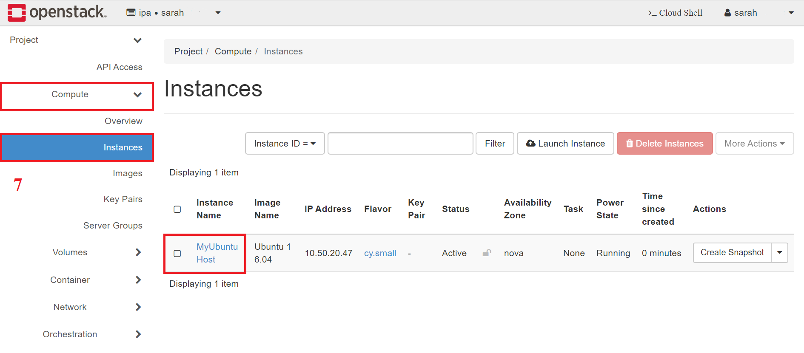

Getting Started (with Horizon)
==============================

To interact with an Openstack hosted VM through a web browser, you
can access the canonical based dashboard through “Horizon”. 

To reach the dashboard for the Georgia Cyber Range, visit:
(https://dashboard.gacyberrange.org)

If you have requested and been issued an account, you may use your login and password. The "domain" field will need to be filled in with "default".

To request an account, contact: cybertraining@augusta.edu

You will be required to sign and return a EULA and adhere to the standards set within while using the range.

Once you've logged in
======================

Interactions with the OpenStack cloud environment will be done within your “project”. 

Your project is the area where you are able to deploy and interact with the resources allocated to
you. You may have access to one, or more projects; additionally, multiple
individuals work within a single project. 

_Familiarizing yourself with the menu
options available on the left hand side of the browser is important._

1) Under your Project tab, you will find everything you need to deploy and
    access your stack.
2) Assuming your have an environment already deployed for use, you can access any of the instances (Virtual Machines), through the web console.  Navigate to, and expand the "Project" list from the menu on the left. 

3) Further expanding the compute tab, you will see the option for “instances”. Highlight and select this option. The "Instance" area that appears in the main area to the right will have all available instances listed. 

4) Select an instace to access and click on the instance name; this opens a new view.

5.) From this view (of a selected, single instance) you will see a “Console” tab at the top. This is where you can
    access the GUI/CLI of the instance OS.

    
Need Help?
==============================
Contact support at 706-721-4000. You can submit a troubleticket and will be contacted as soon as a range support technician is available.  Please ensure you leave good contact information so they may reach you about your issues.

